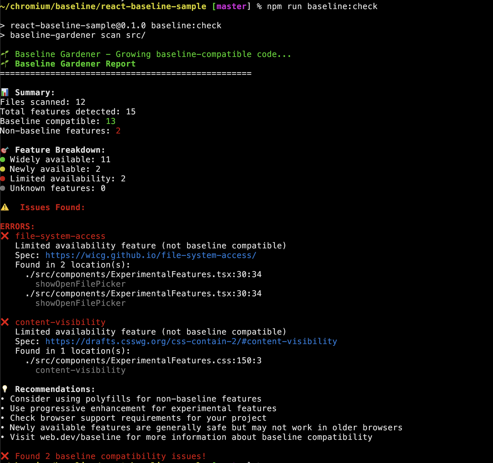

# 🌱 Baseline Gardener

**Nurture baseline-compatible web code - A CI/CD tool to check web feature baseline compatibility**

[](https://badge.fury.io/js/baseline-gardener)
[](https://github.com/hjanuschka/baseline-gardener/actions)

A practical tool for modern web development workflows.

## What is Baseline?

[Baseline](https://web.dev/baseline) provides clear information about which web platform features work across modern browsers. Baseline Gardener helps you:

- ✅ **Avoid compatibility surprises** - Know what won't work before users complain
- 📈 **Make informed decisions** - Data-driven choices about when to adopt new features  
- 🚀 **Ship with confidence** - Automated compatibility checking in CI/CD
- 📊 **Track adoption** - See your baseline compatibility improve over time

## Features

- 🔍 **Multi-language support**: JavaScript, CSS, HTML, Vue, Svelte
- 📊 **Multiple output formats**: Text, JSON, Markdown, SARIF
- 🚨 **CI/CD integration**: GitHub Actions, custom workflows
- ⚙️ **Configurable thresholds**: Widely vs newly available features
- 📝 **Rich reporting**: Detailed compatibility insights
- 🔄 **Always fresh data**: Auto-generates from latest [web-features](https://www.npmjs.com/package/web-features) package

## Quick Start

### Installation

```bash
npm install -g baseline-gardener
```

### Basic Usage

```bash
# Scan current directory
baseline-gardener scan

# Scan specific path
baseline-gardener scan ./src

# Require only widely available features
baseline-gardener scan --require-baseline widely

# Generate markdown report
baseline-gardener scan --format markdown -o report.md
```

## Command Line Options

```bash
baseline-gardener scan [path] [options]

Options:
  -f, --format <format>         Output format (text, json, markdown, sarif)
  --require-baseline <level>    Required baseline level (widely, newly)
  --allow-experimental          Allow non-baseline features
  --update-baseline            Update to latest web-features data
  -o, --output <file>          Output file (default: stdout)
  --config <path>              Path to config file
  -h, --help                   Display help
```

## Configuration

Create a `.baselinerc.json` file in your project root:

```json
{
  "minBaseline": "newly",
  "ignorePaths": [
    "node_modules/",
    "dist/",
    "*.min.js"
  ],
  "ignoreFeatures": [
    "experimental-feature-id"
  ],
  "failOnNonBaseline": true
}
```

## What Gets Detected

### JavaScript APIs
- Browser APIs (`navigator.*`, `window.*`)
- DOM methods (`document.querySelector`, element methods)
- Modern JS features (ES6+, Web APIs)
- Fetch API, Storage APIs, etc.

### CSS Features  
- Properties (`container-type`, `backdrop-filter`)
- Values (`grid`, `flex`, `subgrid`)
- Selectors (`:has()`, `:is()`, `::marker`)
- At-rules (`@container`, `@layer`)

### HTML Elements
- Modern elements (`<dialog>`, `<details>`)
- Input types (`email`, `date`, `color`)
- Attributes (`loading`, `decoding`)

## CI/CD Integration

### GitHub Actions

```yaml
name: Baseline Check
on: [push, pull_request]

jobs:
  baseline:
    runs-on: ubuntu-latest
    steps:
    - uses: actions/checkout@v4
    - uses: actions/setup-node@v4
      with:
        node-version: '20'
    - run: npm install -g baseline-gardener
    - run: baseline-gardener scan --format sarif -o results.sarif
    - uses: github/codeql-action/upload-sarif@v3
      with:
        sarif_file: results.sarif
```

### Other CI Systems

```bash
# Any CI system
npm install -g baseline-gardener
baseline-gardener scan --format json
```

## Output Formats

### Text (Default)
Human-readable terminal output with colors and formatting.

### JSON
Machine-readable format for integration with other tools:

```json
{
  "metadata": { "tool": "baseline-gardener", "version": "1.0.0" },
  "summary": { "totalFiles": 12, "baselineFeatures": 45, "issues": 3 },
  "issues": [...]
}
```

### Markdown
Perfect for documentation and reports:

```markdown
# 🔍 Baseline Guardian Report

## 📊 Summary
- Files scanned: 12
- Baseline compatible: 45
- Issues found: 3
```

### SARIF
For GitHub Code Scanning and security tools integration.

## Real-World Example

Check out our [React demo repository](https://github.com/hjanuschka/react-baseline-sample) that shows baseline-gardener in action with:

- ✅ **Baseline-safe code** using widely available features
- ❌ **Experimental code** using cutting-edge APIs  
- 🔧 **CI/CD setup** with GitHub Actions 

## How It Works

1. **Parse your code** using industry-standard parsers:
   - JavaScript: Babel AST parser
   - CSS: css-tree parser  
   - HTML: htmlparser2

2. **Detect feature usage** through comprehensive mapping tables:
   - JavaScript APIs (global functions, browser APIs, DOM methods)
   - CSS properties and values (modern layout, styling features)
   - HTML elements and attributes (semantic markup, input types)

3. **Check baseline status** against fresh web-features data:
   - High: Widely available (safe everywhere)
   - Low: Newly available (modern browsers)
   - False: Limited availability (experimental)

4. **Generate actionable reports** with clear recommendations

## Development

### Build from source

```bash
git clone https://github.com/hjanuschka/baseline-gardener
cd baseline-gardener
npm install
npm run build
npm link
```

### Testing

```bash
npm test
npm run lint
```

### Updating Feature Mappings

```bash
# Update to latest web-features data
npm run baseline:update
```

### Architecture

```
baseline-gardener/
├── src/
│   ├── parsers/          # Language-specific parsers
│   ├── detectors/        # Feature detection logic  
│   ├── baseline/         # web-features integration
│   ├── reporters/        # Output format generators
│   └── cli.ts           # Command-line interface
├── mappings/            # Dynamic feature mapping tables
│   ├── *-generated.json  # Auto-generated from web-features
│   └── all-features-generated.json
└── package.json
```

## Contributing

We welcome contributions! Please see [CONTRIBUTING.md](CONTRIBUTING.md) for details.

### Adding New Features

Feature mappings are automatically generated from the latest [web-features](https://www.npmjs.com/package/web-features) data:

1. **Run mapping update**: `npm run baseline:update`
2. **Update parsers** if needed for new detection patterns
3. **Add tests** for the new features
4. **Update documentation**

## FAQ

**Q: How accurate is the baseline data?**
A: We use the official [web-features](https://www.npmjs.com/package/web-features) package maintained by the WebDX Community Group and updated regularly.

**Q: Can I customize which features to check?**  
A: Yes! Use `.baselinerc.json` to ignore specific features or file patterns.

**Q: Does this replace caniuse.com?**
A: No, it complements it! This tool automates checking YOUR code against baseline data, while caniuse is for manual research.

**Q: What about polyfills?**
A: Configure ignored features for APIs you're polyfilling. The tool focuses on native browser support.

## License

MIT

## Credits

- Built with [web-features](https://www.npmjs.com/package/web-features) data
- Inspired by [eslint-plugin-compat](https://github.com/amilajack/eslint-plugin-compat)

---

**⭐ Star this repo if baseline-gardener helps you ship better web apps!**